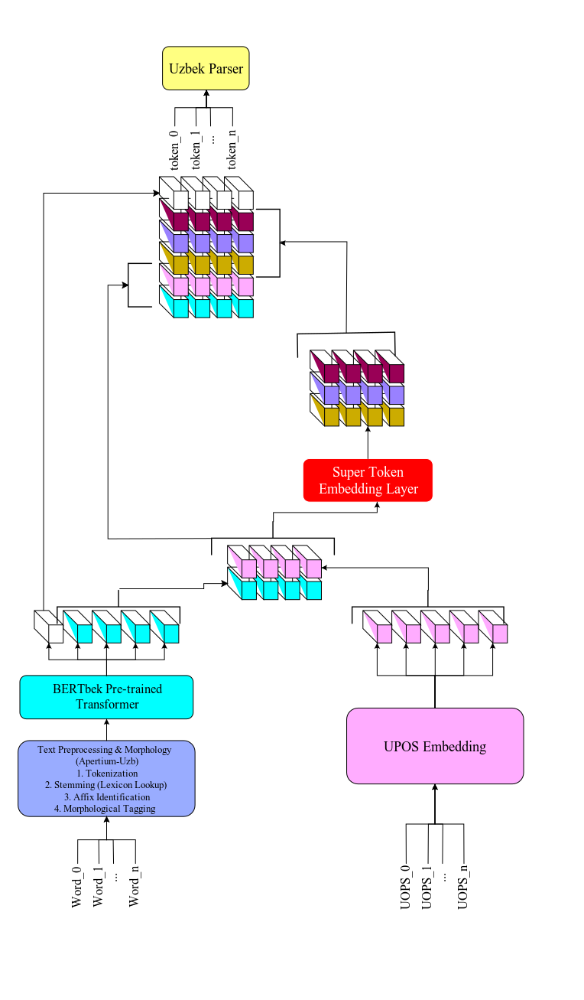

# Towards Robust Uzbek Neural Dependency Parsing

[](https://huggingface.co/Sanatbek/uzudt)
[](https://creativecommons.org/licenses/by-sa/4.0/)

This repository contains the official implementation, evaluation pipelines, and scripts for the paper *Towards Robust Uzbek Neural Dependency Parsing*.

We train and evaluate **Stanza-style neural pipelines** for Uzbek morphosyntactic tagging (UPOS/XPOS/UFeats) and UD dependency parsing (UAS/LAS), comparing two monolingual Uzbek BERT models, Apertium-based morphological normalization, and different subword-to-word fusion strategies across two Uzbek UD treebanks.

---

## Repository Structure

```
robust-parsing-uzbek/
├── stanza/                        # Modified Stanza framework (BERT-enabled POS & depparse)
│   └── stanza/models/
│       ├── tagger.py              # POS tagger entry point (--bert_model supported)
│       ├── parser.py              # Dependency parser entry point (--bert_model supported)
│       ├── pos/                   # POS model, trainer, data, scorer
│       ├── depparse/              # Depparse model, trainer, data, scorer
│       └── common/
│           └── bert_embedding.py  # BERT extraction with pooling strategies
├── scripts/
│   ├── eval.py                    # CoNLL 2018 shared task evaluation
│   ├── eval_pos.py                # POS accuracy evaluation
│   ├── eval_upos_by_tag.py        # Per-tag POS breakdown
│   ├── parse_test_pos_only.py     # POS-only inference script
│   ├── parse_test_with_depparse.py # Full parsing inference script
│   └── apertium_normalize.py      # Apertium-based CoNLL-U normalization
├── config/
│   ├── config.sh                  # Environment paths for Stanza training
│   └── xpos_vocab_factory.py      # XPOS vocabulary factory (incl. Uzbek)
├── data/
│   ├── udbase/
│   │   ├── UD_Uzbek-UzUDT/        # UzUDT treebank (Matlatipov, 684 sents)
│   │   │   ├── uz_uzudt-ud-train.conllu  (451 sents)
│   │   │   ├── uz_uzudt-ud-dev.conllu    (45 sents)
│   │   │   └── uz_uzudt-ud-test.conllu   (188 sents)
│   │   └── UD_Uzbek-UT/            # UT treebank (Akhundjanova & Talamo, 500 sents)
│   │       ├── uz_ut-ud-train.conllu     (330 sents)
│   │       ├── uz_ut-ud-dev.conllu       (33 sents)
│   │       └── uz_ut-ud-test.conllu      (137 sents)
│   ├── pos/                       # Processed POS training data
│   └── depparse/                  # Processed depparse training data
├── wordvec/uz/                    # FastText cc.uz.300.vec (static embeddings)
├── saved_models/
│   ├── pos/                       # Trained POS tagger checkpoints
│   └── depparse/                  # Trained parser checkpoints
├── logs/                          # Training logs
├── RESEARCH_LOG.md                # Detailed research log and findings
└── research-paper.tex             # LaTeX source of the paper
```

---

## Datasets

We evaluate on two Uzbek UD treebanks:

| Treebank | Author(s) | Sentences | Genre | UD Release |
|----------|-----------|-----------|-------|------------|
| **UD_Uzbek-UzUDT** | Matlatipov, Sanatbek | 684 | Literature, Academic | v2.17 |
| **UD_Uzbek-UT** | Akhundjanova & Talamo | 500 | News, Fiction | v2.15 |

Both treebanks are split into train/dev/test using consistent ~66%/7%/27% proportions.

---

## Methodology

<p align="center">
  
  <br>
  <em><b>Figure 1:</b> Baseline Uzbek UD parsing framework.</em>
</p>

The pipeline has three stages:

1. **Preprocessing & Normalization** — Apertium-based morphological normalization stabilizes lemmas and reduces lexical sparsity caused by agglutination and script variation.
2. **Contextual Embedding** — A monolingual Uzbek BERT encodes tokens into subword representations, which are then aggregated to UD word tokens via "super-token" fusion (mean pooling or last-subword selection).
3. **Joint Tagging & Parsing** — A BiLSTM + DeepBiaffine architecture predicts UPOS/XPOS/UFeats tags and dependency arcs+relations.

### Transformer Models

| Model | HuggingFace ID | Notes |
|-------|----------------|-------|
| **TahrirchiBERT** | `tahrirchi/tahrirchi-bert-base` | Uzbek BERT, broad domain |
| **BERTbek** | `elmurod1202/bertbek-news-big-cased` | Uzbek BERT, news-domain, cased |

---

## Setup

### 1. Environment

```bash
python -m venv .venv
.venv\Scripts\activate        # Windows
# source .venv/bin/activate   # Linux/Mac

pip install -U pip
pip install -r requirements.txt
```

### 2. Install Stanza (local modified version)

The modified Stanza code is included in `stanza/`. Install it in editable (development) mode so changes are reflected immediately:

```bash
pip install -e stanza/
```

Verify it works:

```bash
python -m stanza.models.tagger --help
python -m stanza.models.parser --help
```

---

## Experiments

We run 12 experiments testing all combinations of: transformer model, Apertium normalization, and super-token fusion strategy. Each experiment follows the same workflow:

**Step 1:** Train POS tagger → **Step 2:** Re-tag data with trained tagger → **Step 3:** Train dependency parser → **Step 4:** Evaluate on test set

### Experiment Matrix

| Exp | Transformer | Apertium | Fusion | Static Pretrain |
|-----|-------------|----------|--------|-----------------|
| E1 | — | No | — | FastText |
| E2 | — | Yes | — | FastText |
| E3 | TahrirchiBERT | No | last-subword | — |
| E4 | TahrirchiBERT | No | mean | — |
| E5 | TahrirchiBERT | Yes | last-subword | — |
| E6 | TahrirchiBERT | Yes | mean | — |
| E7 | BERTbek | No | last-subword | — |
| E8 | BERTbek | No | mean | — |
| E9 | BERTbek | Yes | last-subword | — |
| E10 | BERTbek | Yes | mean | — |
| E11 | TahrirchiBERT | Yes | mean | FastText |
| E12 | BERTbek | Yes | mean | FastText |

### Training Commands

#### E1: FastText-only baseline (no BERT, no Apertium)

```powershell
# Train POS tagger
python -m stanza.models.tagger --mode train `
  --lang uz --shorthand uz_uzudt `
  --train_file data/pos/uz_uzudt.train.in.conllu `
  --eval_file data/pos/uz_uzudt.dev.in.conllu `
  --wordvec_pretrain_file wordvec/uz/pretrain/fasttext_cc_uz_300.pt `
  --save_dir saved_models/pos --save_name uz_uzudt_E1_tagger.pt

# Re-tag data for parser
python -m stanza.utils.datasets.prepare_depparse_treebank UD_Uzbek-UzUDT `
  --tagger_model saved_models/pos/uz_uzudt_E1_tagger.pt `
  --wordvec_pretrain_file wordvec/uz/pretrain/fasttext_cc_uz_300.pt

# Train dependency parser
python -m stanza.models.parser --mode train `
  --lang uz --shorthand uz_uzudt `
  --train_file data/depparse/uz_uzudt.train.in.conllu `
  --eval_file data/depparse/uz_uzudt.dev.in.conllu `
  --wordvec_pretrain_file wordvec/uz/pretrain/fasttext_cc_uz_300.pt `
  --save_dir saved_models/depparse --save_name uz_uzudt_E1_parser.pt
```

#### E4: TahrirchiBERT + mean pooling (no Apertium)

```powershell
python -m stanza.models.tagger --mode train `
  --lang uz --shorthand uz_uzudt `
  --train_file data/pos/uz_uzudt.train.in.conllu `
  --eval_file data/pos/uz_uzudt.dev.in.conllu `
  --bert_model tahrirchi/tahrirchi-bert-base `
  --bert_pooling mean `
  --no_pretrain `
  --save_dir saved_models/pos --save_name uz_uzudt_E4_tagger.pt
```

#### E8: BERTbek + mean pooling (no Apertium)

```powershell
python -m stanza.models.tagger --mode train `
  --lang uz --shorthand uz_uzudt `
  --train_file data/pos/uz_uzudt.train.in.conllu `
  --eval_file data/pos/uz_uzudt.dev.in.conllu `
  --bert_model elmurod1202/bertbek-news-big-cased `
  --bert_pooling mean `
  --no_pretrain `
  --save_dir saved_models/pos --save_name uz_uzudt_E8_tagger.pt
```

#### E10: BERTbek + Apertium + mean pooling

```powershell
# Step 0: Normalize data with Apertium
python scripts/apertium_normalize.py `
  --input data/pos/uz_uzudt.train.in.conllu `
  --output data/pos/uz_uzudt.train.apertium.conllu
python scripts/apertium_normalize.py `
  --input data/pos/uz_uzudt.dev.in.conllu `
  --output data/pos/uz_uzudt.dev.apertium.conllu

# Step 1: Train tagger on normalized data
python -m stanza.models.tagger --mode train `
  --lang uz --shorthand uz_uzudt `
  --train_file data/pos/uz_uzudt.train.apertium.conllu `
  --eval_file data/pos/uz_uzudt.dev.apertium.conllu `
  --bert_model elmurod1202/bertbek-news-big-cased `
  --bert_pooling mean `
  --no_pretrain `
  --save_dir saved_models/pos --save_name uz_uzudt_E10_tagger.pt
```

#### E12: BERTbek + Apertium + mean pooling + FastText (combined)

```powershell
python -m stanza.models.tagger --mode train `
  --lang uz --shorthand uz_uzudt `
  --train_file data/pos/uz_uzudt.train.apertium.conllu `
  --eval_file data/pos/uz_uzudt.dev.apertium.conllu `
  --bert_model elmurod1202/bertbek-news-big-cased `
  --bert_pooling mean `
  --wordvec_pretrain_file wordvec/uz/pretrain/fasttext_cc_uz_300.pt `
  --save_dir saved_models/pos --save_name uz_uzudt_E12_tagger.pt
```

> **Note:** Replace `uz_uzudt` with `uz_ut` and use the corresponding data paths to run the same experiments on UD_Uzbek-UT.

### Evaluation

```powershell
# POS accuracy
python scripts/eval_pos.py `
  --gold data/udbase/UD_Uzbek-UzUDT/uz_uzudt-ud-test.conllu `
  --system data/udbase/UD_Uzbek-UzUDT/uz_uzudt-ud-test.pos.system.conllu

# Full UD metrics (UAS, LAS, CLAS, MLAS, BLEX)
python scripts/eval.py `
  data/udbase/UD_Uzbek-UzUDT/uz_uzudt-ud-test.conllu `
  data/udbase/UD_Uzbek-UzUDT/uz_uzudt-ud-test.system.conllu
```

---

## Results

Results will be updated as experiments complete. See `RESEARCH_LOG.md` for detailed findings.

| Exp | Transformer | Apertium | Fusion | UzUDT UPOS | UzUDT LAS | UT UPOS | UT LAS |
|-----|-------------|----------|--------|------------|-----------|---------|--------|
| E1 | — | No | — | | | | |
| E2 | — | Yes | — | | | | |
| E3 | TahrirchiBERT | No | last | | | | |
| E4 | TahrirchiBERT | No | mean | | | | |
| E5 | TahrirchiBERT | Yes | last | | | | |
| E6 | TahrirchiBERT | Yes | mean | | | | |
| E7 | BERTbek | No | last | | | | |
| E8 | BERTbek | No | mean | | | | |
| E9 | BERTbek | Yes | last | | | | |
| E10 | BERTbek | Yes | mean | | | | |
| E11 | TahrirchiBERT+FT | Yes | mean | | | | |
| E12 | BERTbek+FT | Yes | mean | | | | |

---

## Key Ablations

The experiments are designed to answer three questions:

1. **Which Uzbek BERT is better?** TahrirchiBERT (`tahrirchi/tahrirchi-bert-base`) vs BERTbek (`elmurod1202/bertbek-news-big-cased`) — compare E3–E6 vs E7–E10.
2. **Does Apertium normalization help?** Compare experiments with/without Apertium (E3 vs E5, E4 vs E6, E7 vs E9, E8 vs E10).
3. **Does super-token fusion strategy matter?** Last-subword selection vs mean pooling — compare E3 vs E4, E5 vs E6, E7 vs E8, E9 vs E10.

---

## Author

**Sanatbek Matlatipov**  
Researcher — National University of Uzbekistan  
s.matlatipov@nuu.uz

---

## Citation

```bibtex
@inproceedings{Matlatipov2025Robust,
  title     = {Towards Robust Uzbek Neural Dependency Parsing},
  author    = {Matlatipov, Sanatbek},
  booktitle = {Proceedings of the Conference (To Appear)},
  year      = {2025}
}
```
